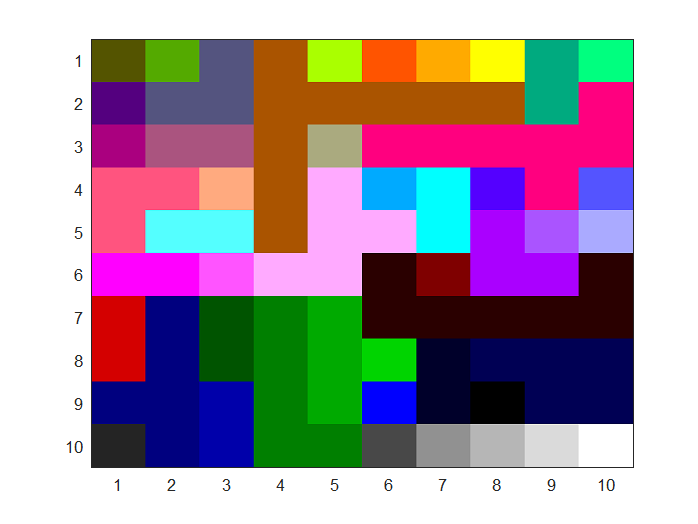
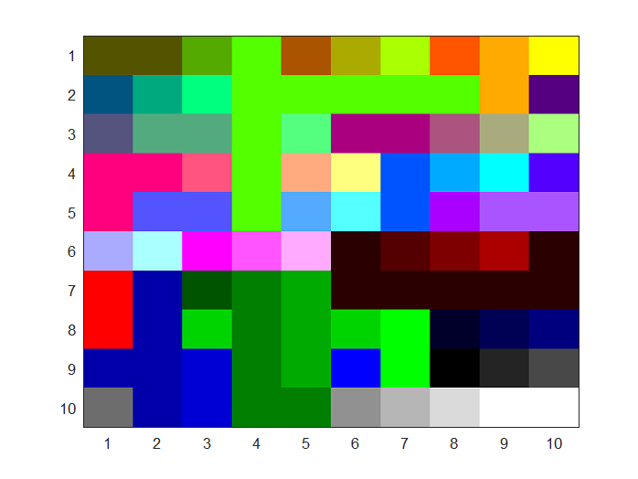

---
author:
- Cameron Cummins and Conor Donihoo
date: December 2020
title: COE 322 Redistricting Project
---

## Disclaimer: This document was originally written in LaTeX and was converted to markdown using pandoc for use in this README. Thus, it has a lot of formatting errors. To see the original version of the report on this project, without the errors, see `Final_Report.pdf`.

# Introduction

Drawing districts in the United States has remained a contentious issue
since its inception. Conflict arises from the act of \"redistricting\"
that occurs about every 10 years (in alignment with the census) when the
legislative body convenes to create a map that outlines the number of
districts, how many voters exist in each one, and where the borders lie.
In an ideal world, the resulting map would produce a representative body
that perfectly reflects the will of the people. In other words, each
political party would receive a legislative representation equal to the
proportion of popular votes it received in the election. It is not
uncommon for a political candidate to assume office despite losing the
popular vote. This same phenomenon occurs at the state level with
specific political parties often receiving more representation with less
popular support. Since this same legislative body dictates how districts
are distributed across the state, it is common and has been openly
admitted that the party in power redraws the districts in their favor.
This is known as \"gerrymandering.\"

In an effort to understand and eventually solve the issue of
gerrymandering, we have developed a simulation and analysis of the
redistricting process. We sought to not only illustrate how
gerrymandering can occur, but also provide insight into ways that it
could be prevented. Our project provides a robust platform for analyzing
a generated or manually inputted population, drawing the districts
either manually or following an algorithm, and compiling the data into a
readable form.

# Inputs and Outputs

Our project uses two dimensional arrays to perform the majority of its
calculations. It takes a population in as its input and outputs a map of
that population within a set of districts. It then analyzes these
districts and counts the number of votes produced by each district.

The inputs for the project are as follows:

-   **Population Distribution** - a two dimensional array with each cell
    containing a population of voters. The position of each cell is
    relative to the geographic position of the area of voters it
    represents. This array can either be manually created from a survey
    or generated via one of the two algorithms discussed in section
    [4](#sec:PopCellAlgo){reference-type="ref"
    reference="sec:PopCellAlgo"}. These cells define the resolution of
    the analysis, with more cells producing a higher fidelity. See
    section [3.3](#sec:PopCell){reference-type="ref"
    reference="sec:PopCell"} for more detail on population cells.

-   **Party Distribution** - a set of parties, with the number of
    occurrences of each party in the set corresponding to the desired
    distribution of affiliated voters in the population. This is only
    applicable when generating the population as opposed to using a
    surveyed set. See section [3.3](#sec:PopCell){reference-type="ref"
    reference="sec:PopCell"} for more information.

-   **Draw Algorithm** - the algorithm to use for drawing the districts.
    See more details on the algorithms available in section
    [5](#sec:DisAlgo){reference-type="ref" reference="sec:DisAlgo"}.

The outputs for the project are as follows:

-   **District Distribution** - a two dimensional map of the districts
    relative to the population cells either inputted or generated. This
    output is discussed in
    section [3.4](#sec:Districting){reference-type="ref"
    reference="sec:Districting"}.

-   **Districts** - vector of districts containing all voters in each
    district and other information relevant to that district.

-   **Population Distribution** - if the distribution is generated, it
    is also outputted as a two dimensional array for comparison
    analysis.

These outputs are achieved by using the following classes and functions:

-   **PopulationCell** - see section
    [3.3](#sec:PopCell){reference-type="ref" reference="sec:PopCell"}

-   **Districting** - see section
    [3.4](#sec:Districting){reference-type="ref"
    reference="sec:Districting"}

-   **Districting::outputDistricting()** - outputs the district ID tags
    for each population cell in the grid to a text file

-   **genPopGridUniformRandom()** - see section
    [4.1](#sec:UniformRandom){reference-type="ref"
    reference="sec:UniformRandom"}

-   **genPopGridUrbanCenter()** - see section
    [4.2](#sec:UrbanCenter){reference-type="ref"
    reference="sec:UrbanCenter"}

-   **outputPopulationGridLean()** - outputs the first character of each
    population cell's party affiliation in a grid to a text file

-   **outputPopulationGridSize()** - outputs the number of voters in
    each population cell in a grid to a text file

The project contains several printing functions that output data to the
console and outputting functions that save this output to readable text
files:

-   **printPopulationLean()** - outputs the leans of each population
    cell in a formatted grid

-   **printPopulationDensity()** - outputs the number of voters in of
    each population cell in a formatted grid

-   **printPopulationIndex()** - outputs the index of each population
    cell in the population cell vector in a formatted grid

-   **printDistrictIDGrid()** - outputs the ID tags associated with the
    district for each population cell, effectively showing the district
    map

-   **printAlgorithmResults()** - counts the votes for each party both
    at the district level (representative) and voter level (popular)

Do note that this project is not designed to be an end-user program. We
intend for this project to be used as a platform for developing more
robust solutions to the issues and complexities surrounding
gerrymandering. A basic implementation of our program could be similar
to the following:

    unsigned int num_rows = 10;
    unsigned int num_cols = 10;
    unsigned int max_population = 10000;
    std::vector<std::string> parties = { "R", "D", "T" };

    std::vector<PopulationCell> pop = genPopGridUrbanCenter(max_population, num_rows, num_cols, parties, 1);

    Districting leanAlgorithm(pop, num_rows, num_cols);
    Districting targetAlgorithm(pop, num_rows, num_cols, 1, "T");
    std::cout << "=== Population Lean ===" << std::endl;
    printPopulationLean(pop, num_rows, num_cols);
    std::cout << "=== Population Density ===" << std::endl;
    printPopulationDensity(pop, num_rows, num_cols);
    std::cout << "=== Target Districts ===" << std::endl;
    printDistrictIDGrid(targetAlgorithm.getDistricting(), num_rows, num_cols);
    std::cout << "=== Lean Algorithm Districts ====" << std::endl;
    printDistrictIDGrid(leanAlgorithm.getDistricting(), num_rows, num_cols);
    std::cout << std::endl;

    outputPopulationGridSize(pop, num_rows, num_cols);
    leanAlgorithm.outputDistricting("lean");
    targetAlgorithm.outputDistricting("target");

    std::cout << "====== Lean Algorithm ======" << std::endl;
    printAlgorithmResults(leanAlgorithm);

    std::cout << "====== Target Algorithm ======" << std::endl;
    printAlgorithmResults(targetAlgorithm);

# Code Overview

## Voter Class

We used the Voter class to represent a person of voting status in the
US; each voter has an

-   **affiliation** that describes the party a voter sides with - used
    to calculate the overall lean of a district (see section
    [3.2](#sec:District){reference-type="ref" reference="sec:District"})

-   **ID** that is unique to every voter - used to keep track of each
    voter in a district (see section
    [3.2](#sec:District){reference-type="ref" reference="sec:District"})

The Voter class has 2 methods:

-   **getID()** - returns the ID of the voter

-   **getAffiliationCode()** - returns the party code the voter
    affiliates with

The textbook called for other functions that were specific to a
two-party analysis, but ultimately did not use them since the scope of
our project includes a multi-party system with unique party codes.

## District Class {#sec:District}

We used the District class to represent a district of voters in the US;
each district has a

-   **vector of voters** - used to cycle through each voter in a
    district and tally up their affiliations for each party

-   **ID** - used to keep track of each individual district in a group
    of districts (which is seen in the Districting class in section
    [3.4](#sec:Districting){reference-type="ref"
    reference="sec:Districting"})

-   **party code** and **party count** for the two parties with the most
    votes - The first party is the most popular party in the district
    while the second party is the second most popular party. Ideally, we
    would use the second party statistics to conduct runoff simulations
    since most US districts require a majority vote. To program this, we
    would have to add a ranked list of preferred affiliations for each
    voter and implement a rank-based system for conducting these runoffs
    (so that voters affiliated with the third parties are considered).
    This proved too complex for the time allotted.

-   **map** of all parties with their respective counts - used to tally
    up the number of affiliations for every party. The first and second
    party codes and counts are then chosen from this.

The District class has 8 methods:

-   **updateAffiliationCounts()** - updates the district's party
    affiliation map

-   **getAffiliationCounts()** - returns the district's party
    affiliation map

-   **updateStats()** - updates the district's statistics

-   **getNumberOfVoters()** - returns the number of voters in the
    district

-   **lean()** - returns the popular affiliation of the voters in the
    district

-   **firstPartyCount()** - returns the number of voters affiliated with
    the popular party

-   **secondPartyCount()** - returns the number of voters affiliated
    with the second most popular party

-   **getVoters()** - returns the vector of voters in the district

## PopulationCell Class {#sec:PopCell}

We used the PopulationCell class to represent an area of a larger
population of voters in the US (you can think of a population cell as a
neighborhood); each population cell has a

-   **map** of all parties with their respective counts - used to tally
    up the number of voters affiliated with each party

-   **lean** - used to describe the popular affiliation of the voters in
    the population cell

-   **size** - describes how many voters are in the cell

-   **vector of voters** - used to cycle through each voter in the cell
    and tally up the number of voters affiliated with each party

-   **double linked list** of other adjacent population cells with the
    same lean - used in the algorithms that perform redistricting

The PopulationCell class has 7 methods:

-   **getLean()** - returns the lean of the population cell

-   **getCounts()** - returns the number of votes for each party

-   **getSize()** - returns the number of voters in the cell

-   **getVoters()** - returns the vector of voters in the cell

-   **updateStats()** - updates the population cell's statistics

-   **linkPopulationCell()** - adds population cell specified as a
    parameter to this population cell's linked list

-   **changeUpstream()** - recursively works up the linked list,
    changing the indices to match the latest linkage

## Districting Class {#sec:Districting}

We used the Districting class to represent a collection of districts in
a large area (you can think of a Districting object as the state of
Texas with all of the districts in it); each Districting object has a

-   **vector of districts** - contains all of the individual districts
    created from the specified population distribution and algorithm

-   **map** of the index of a population cell to the index of a
    district - used to keep track of the population cells in each
    district

-   **map** of all parties with their respective counts on the voter
    level - used to see how the entire population of a Districting
    object affiliates with each party

-   **map** of all parties with their respective counts on the district
    level - used to see how each district in the Districting object
    affiliates with each party

-   **integer** with the total number of voters - used to track the size
    of the entire population

The Districting class has 10 methods:

-   **loadDistricts()** - creates districts out of the population cells

-   **countVotes()** - counts the number of district and popular votes
    for each party

-   **getDistricts()** - returns a vector of all the districts in the
    Districting object

-   **getDistricting()** - returns a vector with the indices of the
    population cells' corresponding districts found in
    **getDistricts()**

-   **outputDistricting()** - outputs the districting vector to a text
    file

-   **getPartyCounts()** - returns the map of the number of districts
    affiliated with each party

-   **getPopularCounts()** - returns the map of the number of voters
    affiliated with each party in the entire districting

-   **getNumOfVoters()** - returns the number of voters in the
    Districting object

-   **districtLean()** - runs the \"lean\" algorithm (refer to section
    [5.1](#sec:LeanAlgo){reference-type="ref" reference="sec:LeanAlgo"})

-   **districtTarget()** - runs the \"targeting\" algorithm (refer to
    section [5.2](#sec:TargetAlgo){reference-type="ref"
    reference="sec:TargetAlgo"})

# Population Cell Algorithms {#sec:PopCellAlgo}

We created two algorithms for generating population distributions. These
functions should serve as the foundation for developing smarter
algorithms to simulate more realistic population distributions.

## Uniform Random {#sec:UniformRandom}

The first algorithm is the simplest and least realistic.

    std::vector<PopulationCell> genPopGridUniformRandom(unsigned int max_population, unsigned int num_rows, unsigned int num_cols, std::vector<std::string> parties, unsigned int seed) {
        std::vector<PopulationCell> grid;
        
        int latest_ID = 0;
        
        std::srand(seed);
        
        for (unsigned int row = 0; row < num_rows; row++) {
            for (unsigned int col = 0; col < num_cols; col++) {
                PopulationCell cell(std::rand() % max_population, parties, latest_ID);
                grid.push_back(cell);
            }
        }
        return grid;
    }

Analyzing the function parameters, this algorithm builds a population
cell array by using the following:

-   **max population** - maximum number of voters in a district

-   **num rows** - number of rows in the two dimensional population cell
    grid

-   **num cols** - number of columns in the two dimensional population
    cell grid

-   **parties** - party distribution to randomly pick party affiliations
    from (to increase odds of one party over another, add more copies of
    that party's code to the vector)

-   **seed** - integer that seeds the random number generator

First, we create a vector to store the population cells in and an
integer to keep track of the next available voter ID. The function
**srand()** is called to seed the random number generator.

    std::vector<PopulationCell> grid;

    int latest_ID = 0;

    std::srand(seed);

We then iterate through each column of each row of the grid we want to
create.

    for (unsigned int row = 0; row < num_rows; col++) {
        for (unsigned int col = 0; col < num_cols; row++) {

At each position in the grid, a cell is created with a random amount of
voters below the maximum, each with an affiliation from the party
distribution and a unique ID. See section
[3.3](#sec:PopCell){reference-type="ref" reference="sec:PopCell"} for
more information on how these population cells are created.

    PopulationCell cell(std::rand() % max_population, parties, latest_ID);
        grid.push_back(cell);

## Urban Center {#sec:UrbanCenter}

While the first algorithm is simple, it is very unrealistic. Most
population distributions are not uniformly random, but instead focused
around cities. This algorithm picks a random position within the grid to
designate as the \"urban center\" and then populates the rest of the
grid around it to mimic the distribution of major cities.

    std::vector<PopulationCell> genPopGridUrbanCenter(unsigned int max_population, unsigned int num_rows, unsigned int num_cols, std::vector<std::string> parties, double density, unsigned int seed) {
        std::vector<PopulationCell> grid;
        int latest_ID = 0;
        std::srand(seed);

        int center_x = rand() % num_cols;
        int center_y = rand() % num_rows;
        double max_dx = double (num_cols) - (center_x);
        double max_dy = double (num_rows) - (center_y);
        if (max_dx < center_x) {
            max_dx = center_x;
        }
        if (max_dy < center_y) {
            max_dy = center_y;
        }

        for (unsigned int y = 0; y < num_rows; y++) {
            for (unsigned int x = 0; x < num_cols; x++) {
                double dx = std::abs(center_x - int(x));
                double dy = std::abs(center_y - int(y));
                double cell_pop_percentage = 1 - (std::pow((dx*dx + dy*dy), 0.5) / (std::pow((max_dx* max_dx + max_dy* max_dy + 1), 0.5)));
                double max_cell_pop = cell_pop_percentage * max_population;
                double min_cell_pop = max_cell_pop * density;
                unsigned int size = std::rand() % int(max_cell_pop - min_cell_pop) + int(min_cell_pop);
                PopulationCell cell(size, parties, latest_ID);
                grid.push_back(cell);
            }
        }
        return grid;

This function's parameters are similar to the previous one's except with
the addition of **density** which specifies how dense the population
should be as it moves further from the urban center.

First, we randomly select a position for the urban center.

    int center_x = rand() % num_cols;
    int center_y = rand() % num_rows;

Then, for every cell, we use the following formulas to determine the
range for how many voters it should contain:

Max Cell Pop. =
$(1 - \sqrt{\frac{dx_*^2+dy_*^2}{dx_m^2 + dy_m^2 + 1}}) max pop$

Min Cell Pop. = (Max Cell Pop.) \* density

    double cell_pop_percentage = 1 - (std::pow((dx*dx + dy*dy), 0.5) / (std::pow((max_dx* max_dx + max_dy* max_dy + 1), 0.5)));
    double max_cell_pop = cell_pop_percentage * max_population;
    double min_cell_pop = max_cell_pop * density;

# Districting Algorithms {#sec:DisAlgo}

These algorithms follow a basic set of assumptions when drawing the
districts.

-   **Continuous** - all districts must be a continuous body with no
    breaks or separations between the population cells.

-   **No Majority** - no districts require a majority to have a
    designated party affiliation.

-   **No Voter Apathy** - all voters in every population cell will
    participate and any voter apathy will not be considered in
    designating the district party affiliation.

For the demonstrations, we will use the following population
distribution:

## Lean {#sec:LeanAlgo}

This algorithm seeks to group similar voters together regionally based
on lean. If any cells are next to each other and have the same lean,
they will be merged into a single district.

First, we iterate through each position in the population grid from left
to right, top to bottom. Since the data is stored in a one dimensional
vector, we need to calculate the index.

    for (unsigned int y = 0; y < pop_num_rows; y++) {
        for (unsigned int x = 0; x < pop_num_cols; x++) {
            unsigned int index = y * pop_num_cols + x;

For each cell, we need to check the top neighbor then the left neighbor.
If the cell doesn't link to either, then it must be its own district.
First, we check the top neighbor if possible. If these cells have the
same lean, then link them and indicate that no new district is needed.

    if (y > 0) {
        unsigned int top_index = ((y - 1) * pop_num_cols) + x;
        if (this_lean == population[top_index].getLean()) {
            population[index].linkPopulationCell(&population[top_index]);
            
            new_district = false;
        }
    }

Next, we check the left neighbor. An additional check is needed to
insure that these districts aren't already linked or we will create a
circular linked-list.

    if (x > 0) {
        unsigned int left_index = (y * pop_num_cols) + (x - 1);
        if (population[left_index].getLean() == this_lean && population[index].district_index != population[left_index].district_index) {
            population[index].linkPopulationCell(&population[left_index]);

            new_district = false;
        }
    }

Lastly, if neither of these cases succeeded in linking the cell, this
cell must be a new district.

    if (new_district) {
        population[index].district_index = next_district_index;
        next_district_index++;
    }

## Targeting {#sec:TargetAlgo}

Unlike the lean algorithm, the targeting algorithm actively tries to
increase a particular party's district representation. In fact, it
produces the most districts possible for the targeted party and the
least possible districts for the other parties. It accomplishes this
effect by simply executing the lean algorithm, but only linking cells
that don't affiliate with the targeted party. The result is individual
districts for every single population cell affiliated with the targeted
party.

To do this, all we need to do is consider this condition when linking
two cells.

    this_lean != target_party

Implemented in both checks for the top and left neighbors:

    if (y > 0) {
        unsigned int top_index = ((y - 1) * pop_num_cols) + x;
        if (this_lean != target_party && this_lean == population[top_index].getLean()) {
            population[index].linkPopulationCell(&population[top_index]);
            new_district = false;
        }
    }
    if (x > 0) {
        unsigned int left_index = (y * pop_num_cols) + (x - 1);
        if (this_lean != target_party && population[left_index].getLean() == this_lean && population[index].district_index != population[left_index].district_index) {
            population[index].linkPopulationCell(&population[left_index]);
            new_district = false;
        }
    }

Looking at the figures 3 and 4, we can see how the two algorithms differ
in their nature. In the second figure, you can see where previously
organized districts are now fragmented into their own individual
districts. This is because targeted affiliations will not be organized
into districts in order to increase the representation of that
affiliation.

# Tests

To demonstrate the purpose and capabilities of our project. We will
perform a series of tests.

## Test 0: Ideal Manual Distribution

For a demonstration of how the analysis tools work, we will create an
ideal population distribution by hand. We will create two voter pools: a
large Democrat majority and a small Republican majority. We will then
place these pools multiple times in a grid to create a distribution of
voters.

    unsigned int num_rows = 4;
    unsigned int num_cols = 4;

    std::vector<Voter> large_democrat = { 
    Voter("D", 0), Voter("D", 0), Voter("D", 0), Voter("D", 0),
    Voter("D", 0), Voter("D", 0), Voter("D", 0), Voter("D", 0),
    Voter("D", 0), Voter("D", 0), Voter("R", 0), Voter("R", 0) };
    std::vector<Voter> small_republican = { 
    Voter("R", 0), Voter("R", 0), Voter("R", 0), Voter("D", 0) };

    PopulationCell large_d(large_democrat);
    PopulationCell small_r(small_republican);

    std::vector<PopulationCell> pop = { 
    large_d, large_d, large_d, small_r,
    small_r, small_r, small_r, small_r,
    large_d, large_d, small_r, small_r,
    small_r, small_r, small_r, small_r };

When creating these voter, we disregard the \"VoterID\" field as 0 for
all voters for simplicity since we will not need it for this analysis.

The lean algorithm appropriately balances the two parties according to
their voter representation. The result reflects the population. The
targeting algorithm, which is designed to gerrymander as much as
possible, clearly gives the Republican Party an unfair advantage.

## Test 1: Even Distribution {#sec:Test1}

In this test, we will create a relatively even distribution of voters
with low fidelity utilizing the population generation functions.

    unsigned int num_rows = 10;
    unsigned int num_cols = 10;
    unsigned int max_population = 10000;
    std::vector<std::string> parties = { "R", "D"};

Both algorithms perform as intended in this test. The lean algorithm
returns a relatively balanced districting while the targeting algorithm
produces a heavy lean in favor of the Republican Party.

## Test 2: Uneven Distribution {#sec:Test2}

This time, we will increase the fidelity by decreasing the size of each
cell and change the party distribution to 75% Republic and 25% Democrat.

    unsigned int num_rows = 100;
    unsigned int num_cols = 100;
    unsigned int max_population = 10;
    std::vector<std::string> parties = { "R", "R", "R", "D"};

In this case, the lean algorithm fails to balance the districts
according to the distribution of voters. The targeting algorithm
rectifies this issue, but gerrymanders to provide the maximum possible
number of districts in favor of the Republic Party. The result is a
districting with too many districts relative to the number of Republican
voters. Another issue is the shear number of districts: 1100 and 9228
districts in total are unreasonable. This is a product of higher
fidelity explained further in section
[7](#sec:SimpLim){reference-type="ref" reference="sec:SimpLim"}.

## Test 3: Lower Fidelity Uneven Distribution

In an attempt to rectify the issues in Test 2, we may attempt to lower
the fidelity (decrease the number of population cells). This defeats the
purpose of the PopulationCell class and is not a viable solution.

    unsigned int num_rows = 10;
    unsigned int num_cols = 10;
    unsigned int max_population = 10000;
    std::vector<std::string> parties = { "R", "R", "R", "D"};

By reducing the fidelity, we effectively render the parties distribution
obsolete. The algorithms work based on the leans of individual cells and
by making the cells large, their leans reflect the distribution. Since
each cell contains 10000 voters, the law of large numbers results in
every cell leaning towards Republican, thus producing a single large
district. The targeting algorithm further reveals this issue since the
number of districts is equal to the number of cells. PopulationCell
objects should be as small as possible and ideally comprised of as few
voters as possible in realistic applications.

# Simplifications and Limitations {#sec:SimpLim}

This project is by no means a realistic model for redistricting an
actual region or state. The goal of this project was to lay the
foundation for a comprehensive model that could objectively draw
districts and thus solve the issue of partisan gerrymandering. Since our
development was on a time constraint, we had to simplify the problem
greatly and accept some limitations for our current model.

In addition to the assumptions discussed in the beginning of section
[5](#sec:DisAlgo){reference-type="ref" reference="sec:DisAlgo"} for
drawing districts, we also have to consider the multitude of variables
associated with representation of an electorate. The geography of a
region can also affect the mapping of districts. The algorithms we wrote
do not consider regional enclaves of any type (cultural, socioeconomic,
etc). This results in a map of districts that splits neighborhoods and
separates population areas that shouldn't be separated. For example, if
a single neighborhood wants their roads renewed, that opinion should not
be split between two districts that may result in that opinion not being
heard by the representatives of those districts.

The nature of both algorithms is also simplified greatly. We implemented
strict rules for forming districts, with the most significant being the
\"continuous body\" condition that requires population cells within a
district to be of the same lean directly next to each other. When the
fidelity of the population increases (the number of cells increases),
the effect of this rule becomes clear: an unrealistic amount of
districts. This is highlighted in Test 2 detailed in section
[6.3](#sec:Test2){reference-type="ref" reference="sec:Test2"}.

To remedy this, we would need to implement a \"tolerance\" function that
allows voters into districts with a different popular party affiliation
(creating districts with voters from each party). We did not have time
to implement this function into the algorithms.

# Challenges {#sec:Chall}

The biggest challenge of the project was coming up with the algorithms
we used to implement redistricting; it took hours of brainstorming and
debugging.

At first, we thought we would attempt to group population cells together
by going through each cell and comparing it to the neighbor on its
right, and, once that was done, going through each cell and comparing it
to the neighbor below it. Even if we looped through that process,
nothing would change after the first alterations.

Then, we decided to improve that process by adding the functionality of
going right to left and bottom to top. This actually worked with the
example we were testing (a 3x3 grid of population cells). Unfortunately,
our strategy no longer worked with larger grids. Instead of grouping all
the similarly-affiliated cells, there would be adjacent cells with the
same affiliations that were not in the same district.

We were able to solve this problem with loops; we decided to start
counting the number of changes each method (left to right, top to
bottom, right to left, and bottom to top) would make on our grid and we
figured that if there were no changes to our grid after a series of 20
iterations, we would have successfully redistricted. This strategy
worked in most cases. However, in some cases (especially with larger
grids) there would be a pattern of changes each time. For example, every
iteration there would be two changes, so it would never get solved. We
realized the main problem with this approach was we kept iterating in
the same pattern, so if we did get stuck, it was impossible to get
unstuck.

Our solution was random numbers: we made a function that would randomly
choose one of the four grid-changing methods discussed earlier. That way
if we ever hit a pattern, it was possible for us to get out of it. This
ended up working for all the grids we gave it. The downside to this
algorithm was that it took too long depending on the random number
generation. Furthermore, if it repeated the same method twice (ex: right
to left and then right to left again), the grid wouldn't change, so the
iteration would have been wasted. Although this algorithm worked, it was
not efficient. We decided we wanted one that was faster and more
reliable, which led us to the linked-list system we have implemented
now.
